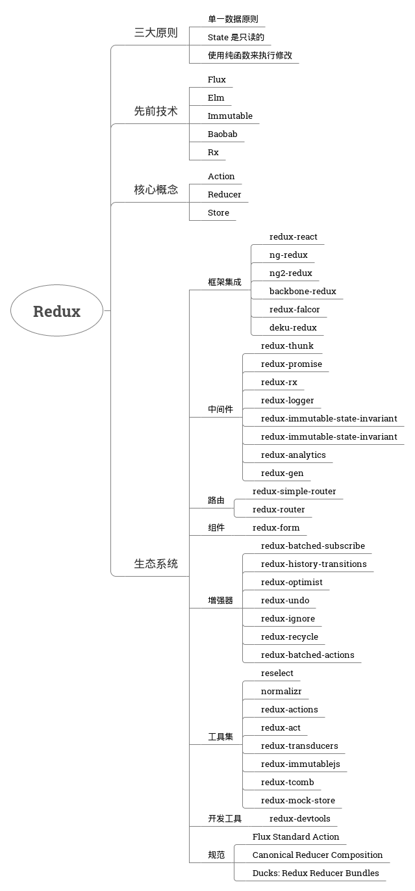

# [简介](http://cn.redux.js.org/)
- 是什么：可预测化的状态管理容器
- 特性

    - 运行于不同的环境：客户端，服务器，原生应用
    - 除了 React，还可以支持其他界面库
    - 超爽的开发体验，如：时间旅行调试器可以编辑后实时预览
    - 体积小，只有 2KB，且没有任何依赖

- 安装：`npm i --save redux`
- 用法：View(DOM，React等) -> Action(描述发生了什么的对象) -> Reducer(纯函数，描述了 action 如何把 state 转变为下一个 state) -> Store(单一数据源) -> 更新 View

# [动机](http://cn.redux.js.org/docs/introduction/Motivation.html)
由于前端单页应用开发越来越复杂，JavaScript 需要管理许多不同来源（服务器，用户交互等）的状态变得非常困难 —— 搞不清楚状态在什么地方，在什么时候，由于什么原因变化。

Redux 是如何解决前端复杂的状态管理？ —— 基于三大原则

# [三大原则](http://cn.redux.js.org/docs/introduction/ThreePrinciples.html)
- 单一数据源
    
    - 规范状态存储，解决传统开发模式中状态存储混乱的问题 ——  基于 jQuery 开发时，很多开发人员都简单的把数据扔到全局命名空间里
    - 让同构应用开发变得非常容易？ —— 待学习
    - 单一的状态树，调试更加容易 —— 可以把状态保存到本地，方便查看状态（以前开发时想看状态必须打印日志来查看，导致打印日志代码泛滥）

- 状态是只读的：确保只能通过触发 Action 来修改状态，所有的修改都被集中化处理，且严格按照一个接一个的顺序执行

    Action 只是普通对象，可以被日志打印，可以在维护时很方便的找到状态改变的来源。

    相比起来，以往开发在无论生成还是开发环境代码的各个地方都存在着 `console.log`（曾今看到一个函数里写了 10 多个日志打印）。而 redux 可以利用中间件，可插拔式的开启或关闭日志打印，可以减少大量的日志打印代码。

- 使用纯函数来执行修改：Reducer 只能是一些纯函数 —— 便于编写可复用的 reducer

# [先前技术](http://cn.redux.js.org/docs/introduction/PriorArt.html)
Flux 是一个混合产物，了解 Redux 与其他技术的相似与不同之处

- Flux

    - 相同点：Redux 的灵感来源于 Flux 的几个重要特性，他们都是将模型的更新逻辑全部集中于一个特定的层；
    - 不同点：Redux 没有 Dispatcher，且不支持多个 Store，只有一个单一的 Store 和一个根级的 reduce 函数；

- Elm：

    - 相同点：Elm 的 “updater” 与 Redux 里的 reducer 服务于相同的目的；
    - 不同点：Elm 是一种函数式编程语言，在执行纯度，静态类型，不可变动性，action 和模式匹配等方面更具优势；

- Immutable：Immutable 是一个可实现持久数据结构的 JavaScript 库，可以与 Redux 对接良好。
- Baobab：Baobab 实现了数据不可变特性的 API —— 用以更新纯 JavaScript 对象，可以在 Redux 中使用，但没有什么优势。
- Rx：Reactive Extensions 是管理复杂异步应用非常优秀的方案，和 Redux 一起使用，可以配合得很好。

# [生态系统](http://cn.redux.js.org/docs/introduction/Ecosystem.html)

# [示例](http://cn.redux.js.org/docs/introduction/Examples.html)
1. 最基本的用法：View，Create Action，Action，Reducer，Store

    - https://github.com/reactjs/redux/tree/master/examples/counter-vanilla

2. 如何与界面框架搭配使用，如 redux-react

    - https://github.com/reactjs/redux/tree/master/examples/counter
    - https://github.com/reactjs/redux/tree/master/examples/todos-with-undo
    - https://github.com/reactjs/redux/tree/master/examples/todomvc

3. 常用的 Redux 模式

    - 实现异步 Action
    
        https://github.com/reactjs/redux/tree/master/examples/async

    - 使用 ID 来标准化存储数据实体

        https://github.com/reactjs/redux/tree/master/examples/shopping-cart

    - 在不同层级将多个 reducer 组合使用

        https://github.com/reactjs/redux/tree/master/examples/shopping-cart

    - 深层嵌套树状视图的渲染

        https://github.com/reactjs/redux/tree/master/examples/tree-view

    - 使用 Redux Logger 生成日志
    
        https://github.com/reactjs/redux/tree/master/examples/shopping-cart

4. 服务端渲染：https://github.com/reactjs/redux/tree/master/examples/universal
5. 完整的应用示例：https://github.com/reactjs/redux/tree/master/examples/real-world

# 总结
1. Redux 使程序的每一部分细分：Store 只关注 state，视图中的组件只关注展示数据和触发事件，Actions 只关注 state 的变化和其内部的数据，Reducers 只关注融合旧的 state 和 actions 到新的 state —— 很多 jQuery 时代的程序代码完全没有组织结构，常常需要全文搜索来定位代码（虽然后面也诞生了相关的 
MVC 框架）
2. Redux 的单一数据源使得调试变得更加的简单，可以在调试的时候很方便的查看应用状态 —— 想想以前是怎么加断点打印数据的吧！
3. Redux 的状态是只读的，无论是哪种数据来源（服务端或客户端）都只能通过触发 Action 来修改状态，这使得代码变得更加严谨，并且结合 Redux 的中间件可以很容易拦截动作实现一些特殊的功能，例如：redux-logger，redux-redo 等 —— redux-logger 可以自动在操作前后打印日志，这在以前往往是手工干的活（哭脸）；

**TODO**

Flow VS MVC VS MVVM
